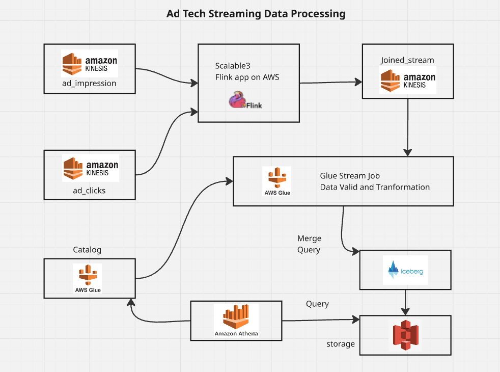

# Ad Tech Streaming Pipeline

## Project Overview
This project implements a real-time **Ad Tech Streaming Pipeline** using **PyFlink** and **Spark Structured Streaming**, designed to process ad impressions and clicks with minimal latency. The pipeline performs a **time-bounded join** between ad impressions and clicks (±30 seconds) and writes the output to a Kinesis stream.  

The architecture ensures scalable, fault-tolerant, and event-time aware processing for high-throughput ad tech workloads.

---

## Components

### 1. Flink Streaming Job (`flink-job/main.py`)
- **Purpose**: Performs a **real-time join** between ad impressions and ad clicks based on event time.  
- **Why**: Joins ad impression and click events to calculate key metrics like CTR (Click-Through Rate) in near real-time.  
- **Features**:
  - Uses **WATERMARKS** for event-time processing
  - Time-bounded join (±30 sec)
  - Reads/Writes to **Amazon Kinesis**
  - Configurable via `application_properties.json` for local/dev/KDA environment  

### 2. Spark Structured Streaming Job (`spark-job/main.py`)
- **Purpose**: Processes streaming data into **Iceberg/Delta tables** for downstream analytics.  
- **Why**: Enables **historical aggregation, batch queries, and reporting** while keeping the pipeline scalable.  
- **Features**:
  - Handles large-scale streaming transformations
  - Writes to **Iceberg tables** for ACID-compliant storage
  - Integrates with **AWS Glue Catalog** for schema management  

### 3. Maven POM (`pom.xml`) + Assembly Descriptor (`assembly/assembly.xml`)
- **Purpose**: Packages PyFlink job and Java dependencies into a deployable package for **AWS Kinesis Data Analytics (KDA)**.  
- **Why**: Ensures all dependencies (Flink connectors, Python scripts, JARs) are bundled in a single ZIP/JAR for deployment.  
- **Features**:
  - Shade Plugin → fat JAR with all dependencies  
  - Assembly Plugin → packages Python scripts + JARs  

### 4. Configs (`configs/`)
- **Purpose**: Stores **Glue jobs, Athena queries**, and other runtime configurations.  
- **Why**: Separates code from environment-specific configurations for easier maintenance.  

### 5. Checkpoints (`checkpoints/`)
- **Purpose**: Stores **state snapshots** for Flink streaming jobs.  
- **Why**: Enables **fault tolerance** and ensures exactly-once processing semantics.  
- **Note**: This folder is excluded from Git; checkpoints are written to S3 at runtime.  

---

## Tech Stack
- **Streaming**: PyFlink, Spark Structured Streaming  
- **Data Sources & Sinks**: Amazon Kinesis, Delta Lake / Iceberg tables  
- **Deployment**: AWS Kinesis Data Analytics (KDA), Maven packaging  
- **Storage & Query**: S3, AWS Glue, Athena  
- **Languages**: Python, Java  

---

## GitHub Repo Structure

